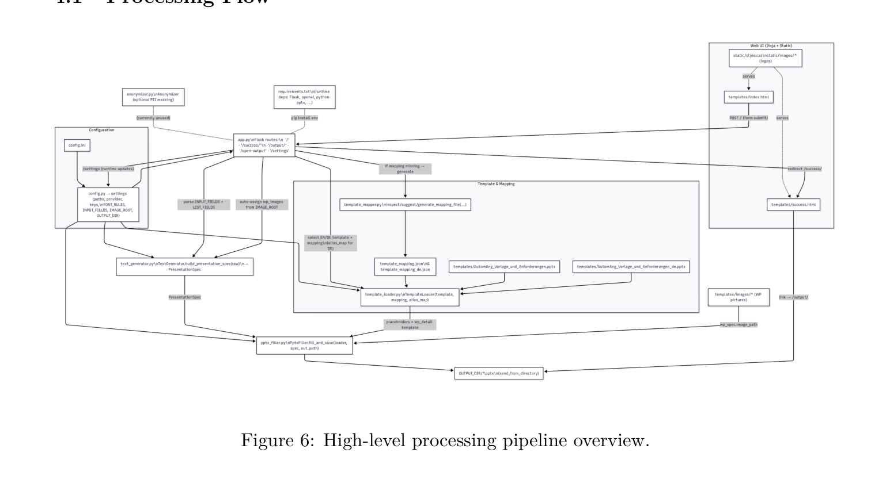
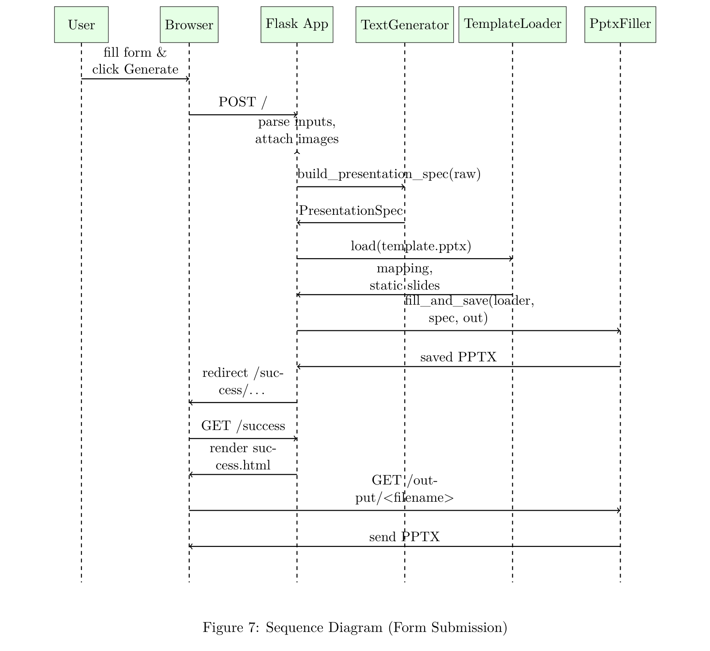
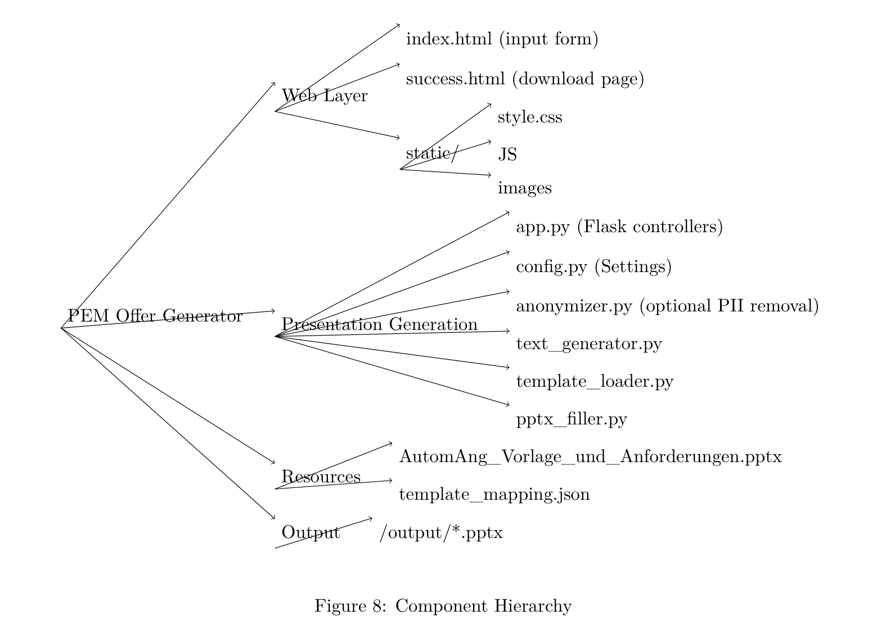

# AI-based Offergenerator for Industrial Projects

A professional showcase repository for an AI-assisted PowerPoint offer generator used to streamline the creation of branded industrial project offers.

> **Evidence-layer repository:** This public package documents the product, architecture, workflows and outcomes **without disclosing the proprietary implementation**.

## Overview
The system converts structured project inputs into polished PowerPoint offers. Users enter cover information, project context and work-package data in a browser form. The application then:

1. validates and structures the input,
2. uses an LLM to expand short inputs into presentation-ready content,
3. selects the correct EN/DE template and mapping,
4. fills a PowerPoint template automatically, and
5. generates a downloadable `.pptx` offer document.

This architecture was designed to reduce manual slide work, improve wording consistency and keep branding stable across generated offers.

## What the software demonstrates
- End-to-end product thinking from user input to downloadable deliverable
- AI-assisted content generation with structural and formatting constraints
- Template-driven document automation for PowerPoint
- Multi-language handling (English / German)
- Configuration-driven deployment and operations
- Practical separation between UI, generation logic, template loading and PPTX rendering

## High-level architecture
### 1) Processing flow

### 2) Form submission sequence

### 3) Component hierarchy

## User workflow
A typical user workflow is:
- Open the browser-based interface
- Enter cover metadata such as project title, offer number, customer, location and date
- Select the target language (EN/DE)
- Enter short project context for **Initial Situation** and **Project Goals**
- Add one or more work packages including objectives, approach, expected results and required client input
- Generate the presentation and download the resulting PowerPoint file

A cropped interface impression from the manual is included below.

## Repository contents
- `README.md` – main project overview
- `docs/architecture.md` – system structure and technical flow
- `docs/user-workflows.md` – user and operator workflows
- `docs/deployment-and-operations.md` – installation and operational setup summary
- `docs/security-and-privacy.md` – public-safe security notes
- `docs/performance-and-scalability.md` – operational and scaling considerations
- `docs/engineering-boundaries.md` – what is intentionally not disclosed publicly
- `docs/portfolio-evidence.md` – employer-facing evidence of engineering work
- `docs/diagram-provenance.md` – origin of included diagrams and screenshots
- `CHANGELOG.md` – package history
- `LICENSE.md` / `NOTICE.md` – documentation and asset usage notice
- `github-repository-description.txt` – short repository description

## Engineering boundaries
This repository intentionally does **not** publish:
- proprietary source code,
- prompt implementations in full detail,
- internal templates or mapping internals beyond high-level structure,
- secrets, API keys, `.env` values or deployment credentials,
- internal customer data or sensitive business content.

## Target audience
This showcase is designed for:
- employers and headhunters,
- engineering managers,
- technical interviewers,
- partners evaluating the engineering scope of the solution.

## Author
**Martin Khadjavian**  
Copyright © Martin Khadjavian
