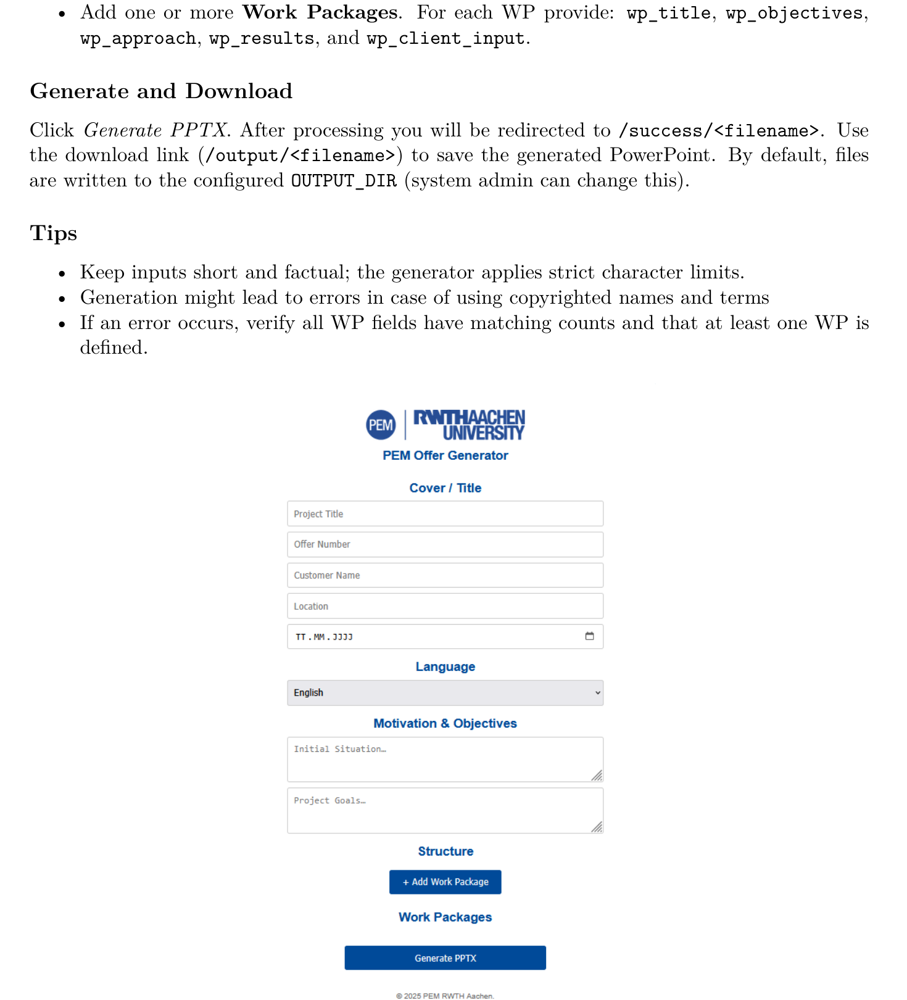

# User Workflows

## Primary workflow: generate an offer
1. Open the browser-based application.
2. Enter cover data such as project title, offer number, customer, location and date.
3. Select the target language (English or German).
4. Provide short input text for the initial situation and project goals.
5. Add one or more work packages.
6. For each work package, enter title, objectives, approach, results and client input.
7. Trigger PowerPoint generation.
8. Open the success/download page and retrieve the `.pptx` file.

## Data captured from the form
The user-facing workflow described in the manual includes:
- cover metadata,
- project context,
- language selection,
- repeated work-package blocks.

This is a strong example of practical form-driven business automation.

## Why the workflow is valuable
The workflow reduces repetitive manual editing by moving from ad-hoc document writing to a structured generation process. It also creates a repeatable standard for offer quality and slide structure.

## UI reference

## Expected result
The output is a professional, branded PowerPoint offer document ready for review, internal refinement or external delivery.
